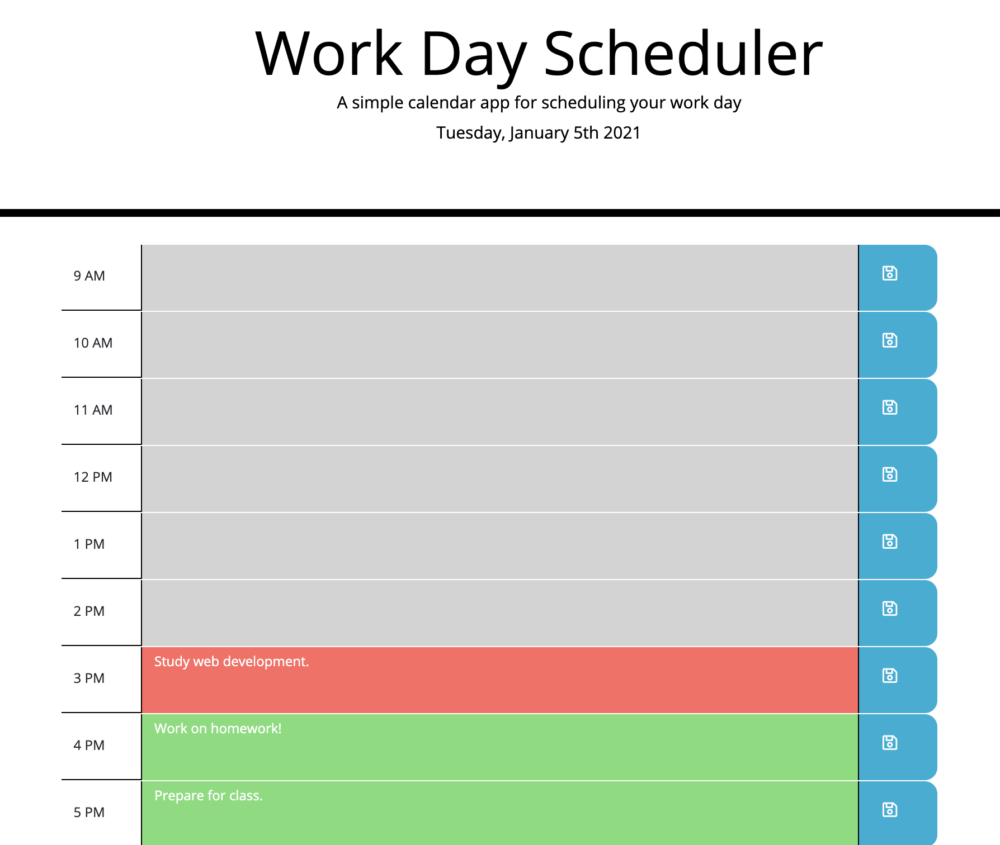

# WorkDayScheduler
A work day schedule app that allows users to input daily scheduled events. Work day events are split up by the hour between 9 AM - 5 PM. Once an event has been enetered into an hourly timeslot, users may click the blue 'Save' button to save that event to the schedule. The grey colored timeslots indicate the hour has already passed for the day, the red color indicates the current hour, and green indicates future hours. 

## Technologies
- HTML5
- CSS
- Bootstrap v4.3.1
- Javascript
- jQuery
- VSCode

## Mock-Up

## Demo
- https://nvandenberge.github.io/Homework05-WorkDayScheduler/

